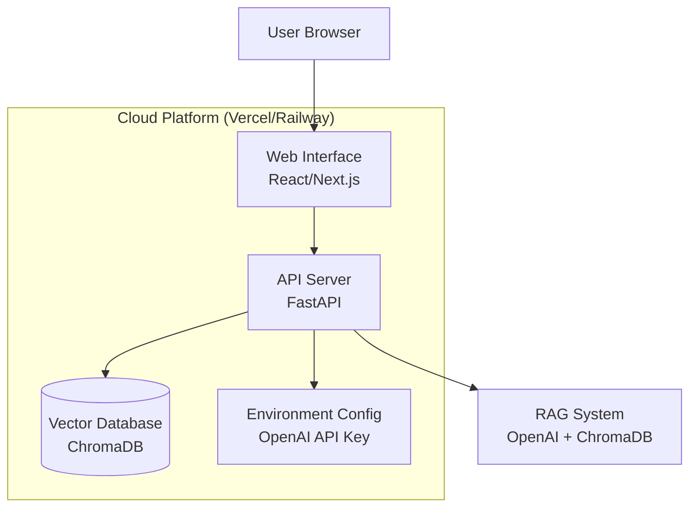
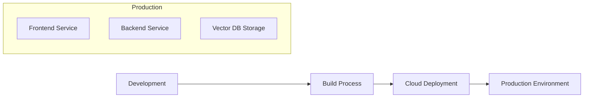

# Design Document: AI Job Seeker Deployment

## Overview

AI就活生アプリケーションを現在のローカル実行環境からクラウドベースのWebアプリケーションに移行する設計。FastAPIを使用したRESTful APIサーバー、React/Next.jsベースのWebフロントエンド、そしてVercelまたはRailway等のクラウドプラットフォームでのデプロイメントを実装する。

## Architecture

### System Architecture



### Deployment Architecture



## Components and Interfaces

### 1. Web Interface Component

**Technology**: React with Next.js framework
**Responsibilities**:
- ユーザーインターフェースの提供
- 質問入力フォームの管理
- API通信の処理
- レスポンス表示とローディング状態管理

**Key Interfaces**:
```typescript
interface QuestionRequest {
  question: string;
}

interface AnswerResponse {
  answer: string;
  sources?: string[];
  timestamp: string;
}

interface ConversationHistory {
  id: string;
  question: string;
  answer: string;
  timestamp: string;
}
```

### 2. API Server Component

**Technology**: FastAPI (Python)
**Responsibilities**:
- RESTful APIエンドポイントの提供
- リクエスト検証とエラーハンドリング
- RAGシステムとの統合
- CORS設定とセキュリティ

**Key Endpoints**:
```python
POST /api/ask
- Input: {"question": str}
- Output: {"answer": str, "sources": List[str], "timestamp": str}

GET /api/health
- Output: {"status": "healthy", "timestamp": str}

POST /api/reindex (管理用)
- Input: 認証トークン
- Output: {"status": "success", "message": str}
```

### 3. RAG System Component

**Technology**: 既存のPythonコード（OpenAI + ChromaDB）
**Responsibilities**:
- 質問の埋め込みベクトル生成
- ベクトル検索による関連文書取得
- OpenAI APIを使用した回答生成

**Refactored Interface**:
```python
class RAGService:
    def __init__(self, chroma_client: chromadb.Client, openai_client: OpenAI):
        self.chroma_client = chroma_client
        self.openai_client = openai_client
        
    async def generate_answer(self, question: str) -> dict:
        # 既存のgenerate_answer関数をクラスメソッドとして実装
        pass
        
    async def health_check(self) -> bool:
        # データベース接続とOpenAI APIの健全性チェック
        pass
```

### 4. Vector Database Component

**Technology**: ChromaDB (永続化ストレージ)
**Responsibilities**:
- マークダウンファイルのベクトル化データ保存
- 高速な類似度検索
- データの永続化

**Initialization Process**:
```python
class VectorDBManager:
    def __init__(self, db_path: str):
        self.client = chromadb.PersistentClient(path=db_path)
        
    async def initialize_from_markdown(self, source_dir: str):
        # 既存のsave_vector.pyロジックを統合
        pass
        
    async def query_similar(self, embedding: List[float], n_results: int = 3):
        # 既存のクエリロジック
        pass
```

## Data Models

### Request/Response Models

```python
from pydantic import BaseModel
from typing import List, Optional
from datetime import datetime

class QuestionRequest(BaseModel):
    question: str
    
    class Config:
        min_anystr_length = 1
        max_anystr_length = 1000

class AnswerResponse(BaseModel):
    answer: str
    sources: List[str] = []
    timestamp: datetime
    processing_time_ms: int

class HealthResponse(BaseModel):
    status: str
    timestamp: datetime
    database_status: str
    openai_status: str

class ErrorResponse(BaseModel):
    error: str
    message: str
    timestamp: datetime
```

### Vector Database Schema

```python
# ChromaDBコレクション構造
collection_schema = {
    "name": "markdown_rag",
    "metadata": {
        "file": str,           # 元ファイル名
        "heading": str,        # セクション見出し
        "heading_path": str,   # 階層化された見出しパス
        "chunk_index": int     # チャンク番号
    },
    "documents": str,          # テキスト内容
    "embeddings": List[float], # ベクトル表現
    "ids": str                 # ユニークID
}
```

## Correctness Properties

*A property is a characteristic or behavior that should hold true across all valid executions of a system-essentially, a formal statement about what the system should do. Properties serve as the bridge between human-readable specifications and machine-verifiable correctness guarantees.*

### Property Analysis

まず、要件の各受け入れ基準を分析して、テスト可能なプロパティを特定します。

<function_calls>
<invoke name="prework">
<parameter name="featureName">ai-job-seeker-deployment